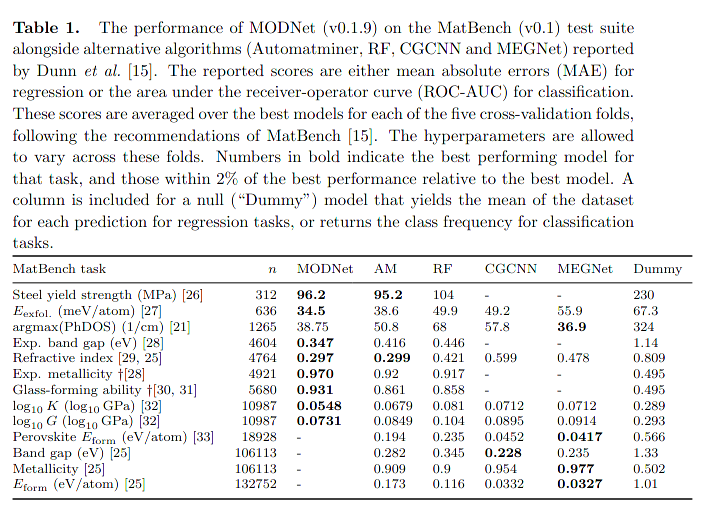

# Benchmarking MODNet on Matbench v0.1

This repository contains benchmark data for the [MODNet package](https;//github.com/ppdebreuck/modnet) run on [Matbench v0.1]([200~https://hackingmaterials.lbl.gov/automatminer/datasets.html) datasets. 
Full details can be found in the following papre:
> *Robust model benchmarking and bias-imbalance in data-driven materials science: a case study on MODNet*  
> Pierre-Paul De Breuck, Matthew L. Evans, Gian-Marco Rignanese  
> Journal of Physics: Condensed Matter (2021)  
> DOI: [10.1088/1361-648X/ac1280](https://doi.org/10.1088/1361-648X/ac1280).

The entrypoint to running the benchmarks is the `run_benchmark.py` script, which requires the Python implementation of MODNet to be installed. 
Benchmarks can be run with the directory structure in this repository as `python run_benchmark.py --task dielectric` for e.g. the `matbench_dielectric` task.

Pre-computed or cached data will be used where possible, pending full upload of models and featurized dataframes to e.g. figshare. This repository currently contains *some* precomputed data (hence the ~400 MB size) but this will be moved to Figshare (and removed from the git history) in the future.

The reported benchmark results can be found in the `results` subfolder for each task as pickled Python dictionary with associated plots in the `plots` subfolders.

Results table:

